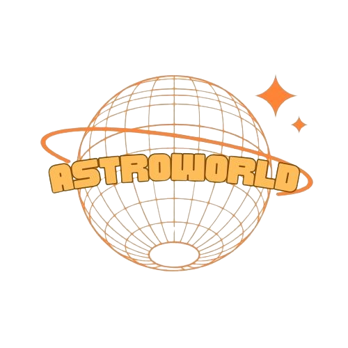

<h1 align="center">✨ ASTROWORLD ✨ </h1>

 
<h1 align="center">📋 Description </h1>
This is a game about an astronaut from the planet ,,Earth” , but on his last expedition his spacecraft exploded and now his parts are scattered across the planet ,,Mars”. Your job is to help him put them together so he can go back to his loved ones and complete his mission. However, he has a certain amount of time before he runs out of oxygen, his clock is already ticking so be as fast as you can!
 
<h1 align="center">TEAM MEMBERS 👨🏻‍💻</h1>

<table >
  <tr>
    <td>Name</td>
    <td>Role</td>
    <td>Grade</td>
  </tr>
  <tr>
    <td> Dimaya Noneva</td>
    <td>Scrum trainer</td>
    <td>🟥 9B</td>
  </tr>
  <tr>
    <td>Stoyan Hristov</td>
    <td>Back-end developer</td>
    <td>🟥 9B</td>
  </tr>
  <tr>
    <td>Stiliyan Dimitrov</td>
    <td>Back-end developer</td>
    <td>🟥 9B</td>
  </tr>
  <tr>
    <td>Jaklin Yankova</td>
    <td>Back-end developer</td>
    <td>🟥 9B</td>
  </tr>
  
</table> 

 
<h1 align="center">📄 Documents</h1> 
    
<h1 align="center">Used technologies 🗂</h1>

    
   
  <a href="https://www.microsoft.com/en-us/microsoft-365/powerpoint">
  
 
  

<h1 align="center"> 🚀 Languages and Libraries</h1>

